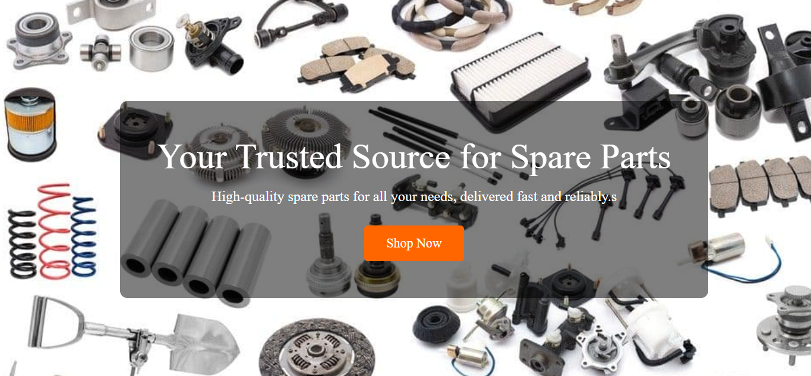
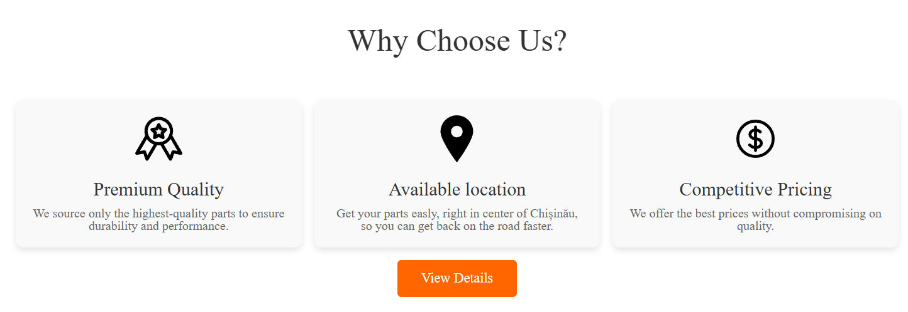
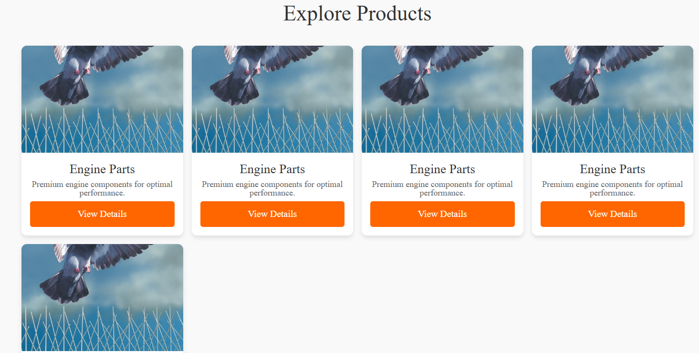

# Spare Parts Landing Page

Welcome to the **Spare Parts Landing Page** repository! This project is a responsive and modern landing page designed for a spare parts business. It showcases high-quality spare parts, highlights the benefits of choosing the business, and provides contact information for customers.

## Features
- **Hero Section**: A visually appealing introduction with a call-to-action button.
- **Why Choose Us Section**: Highlights the business's unique selling points (quality, location, pricing).
- **Shop Section**: Displays products in a responsive grid layout.
- **View Details Section**: Provides contact information and an embedded Google Map for easy location access.

## Screenshots
Here are some screenshots of the landing page:

### Hero Section

### Why Choose Us Section

### Shop Section

### View Details Section

## Live Demo
Check out the live demo of the landing page: [Live Demo](https://rodionclepa.github.io/tum-web-lab2/)  